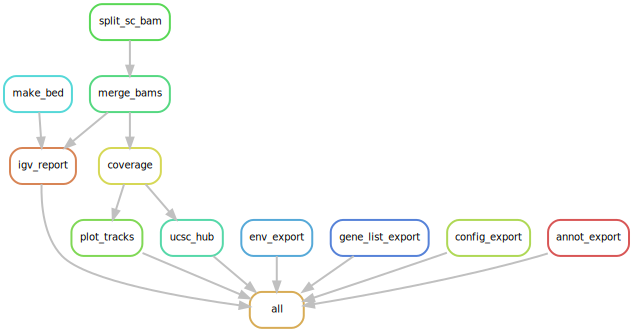

# Genome Browser Track Visualization Snakemake Workflow Powered by pyGenomeTracks for Aligned BAM Files
A [Snakemake](https://snakemake.readthedocs.io/en/stable/) workflow for easy visualization of genome browser tracks of aligned BAM files (e.g., RNA-seq, ATAC-seq,...) powered by the wrapper [gtracks](https://gitlab.com/salk-tm/gtracks) for the package [pyGenomeTracks](https://github.com/deeptools/pyGenomeTracks).

This workflow adheres to the module specifications of [MR.PARETO](https://github.com/epigen/mr.pareto), an effort to augment research by modularizing (biomedical) data science. For more details and modules check out the project's repository.

**If you use this workflow in a publication, don't forget to give credits to the authors by citing the URL of this (original) repository (and its DOI, see Zenodo badge above -> coming soon).**

Table of contents
----------------
  * [Authors](#authors)
  * [Software](#software)
  * [Methods](#methods)
  * [Features](#features)
  * [Usage](#usage)
  * [Configuration](#configuration)
  * [Examples](#examples)
  * [Links](#links)
  * [Resources](#resources)
  * [Publications](#publications)

# Authors
- [Stephan Reichl](https://github.com/sreichl)

# Software
This project wouldn't be possible without the following software and their dependencies:

| Software | Reference (DOI) |
| :---: | :---: |
| deeptools | https://doi.org/10.1093/nar/gkw257 |
| gtracks | https://gitlab.com/salk-tm/gtracks |
| pygenometracks | https://doi.org/10.1093/bioinformatics/btaa692 |
| samtools | https://doi.org/10.1093/bioinformatics/btp352 |

# Methods
This is a template for the Methods section of a scientific publication and is intended to serve as a starting point. Only retain paragraphs relevant to your analysis. References [ref] to the respective publications are curated in the software table above. Versions (ver) have to be read out from the respective conda environment specifications (workflow/envs/\*.yaml file) or post execution in the result directory (/envs/genome_tracks/\*.yaml). Parameters that have to be adapted depending on the data or workflow configurations are denoted in squared brackets e.g., [X].

__Processing.__ Aligned (and filtered) BAM files were merged by [group] using samtools (ver) [ref]. Each BAM file was converted to a bigWig file for dowmnstream analysis and visualization using bamCoverage from the command line tool deepTools (ver) [ref]. Finally, we extracted coordinates, extended start and end by [base_buffer] bases, and number of isoforms of all relevant genes/genomic regions [gene_list] from the 12 column BED file genome [genome] annotation [genome_bed].

__Visualization.__ Visualizations for each relevant gene/genomic region and [category] were generated by using the prepared bigWig files and vertically stacking genome browser tracks with their annotation at the [x_axis] and each track scaled by [y_max] reads. Additionally, a visualization including all categories per gene/genomic region was generated. The plotting was performed using the python wrapper gtracks (ver) [ref] for the package pyGenomeTracks (ver) [ref].

**The processing and visualizations described here were performed using a publicly available Snakemake (ver) [ref] workflow [ref - cite this workflow here].**

# Features
The workflow performs the following steps that produce the outlined results:

- Processing
  1. BAM files of the same group are merged and indexed using samtools. (merged_bams/{group}.bam)
  2. A bigWig file per merged BAM file is generated using deepTools::bamCoverage. (bigwigs/{group}.bw)
  3. Information per requested gene from the 12-column BED file is retrieved (not necessary for genomic regions).
      - coordinates from the 12-column BED file are extracted and extended at start/end by the parameter base_buffer.
      - the number of isoforms i.e. number of lines in the BED file is determined (__only for genes, for genomic regions it is hardcoded to 1__) to plot below the tracks.
- Visualization
  - generate one plot per category of bigWigs and gene/region with the before determined gene-parameters i.e, coordinates and gene-rows (tracks/{category}\_{gene/region}.svg).
  - generate one plot including __ALL__ categories per gene/region (tracks/ALL\_{gene/region}.svg)

# Usage
Here are some tips for the usage of this workflow:
- Start with the 5-10 most interesting genes (e.g., the most differentially expressed between conditions) and few/relevant samples for a test run.
- Set y-max to auto (i.e., '') for the first run to get a feeling of the magnitudes.
- Merging BAM files and generating bigWig files takes longest, but is performed only once. The plot generation for different genes/genomic regions afterward is very fast. Therefore, it is recommended to get the workflow going with a few samples and then increase the number of samples.

# Configuration
Detailed specifications can be found here [./config/README.md](./config/README.md)

# Examples
--- COMING SOON ---

# Links
- [GitHub Repository](https://github.com/epigen/genome_tracks/)
- [GitHub Page](https://epigen.github.io/genome_tracks/)
- [Zenodo Repository (coming soon)]()
- [Snakemake Workflow Catalog Entry](https://snakemake.github.io/snakemake-workflow-catalog?usage=epigen/genome_tracks)

# Resources
- [UCSC Genome Browser annotation track database](https://genome.ucsc.edu/cgi-bin/hgTables)
    - recommended source for the required 12 column BED file annotation of the respective genome.

# Publications
The following publications successfully used this module for their analyses.
- ...
